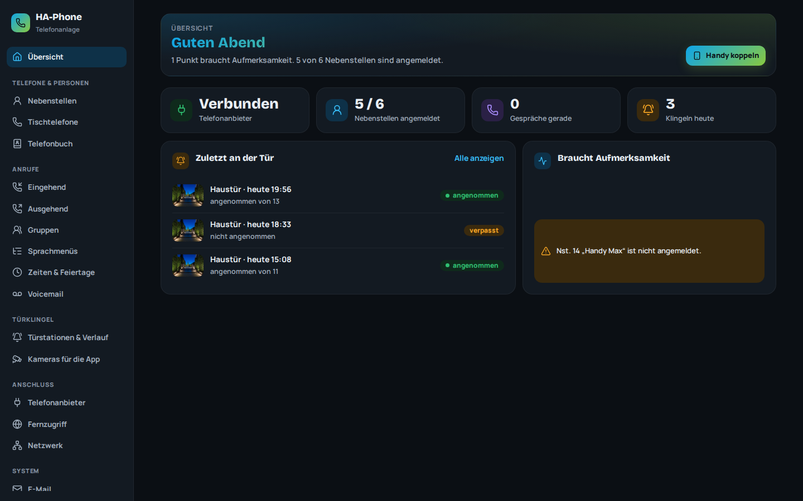
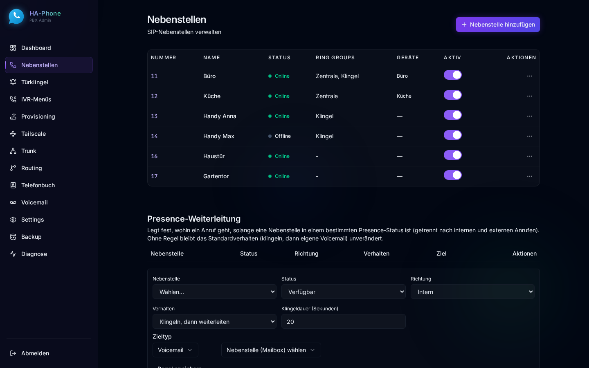
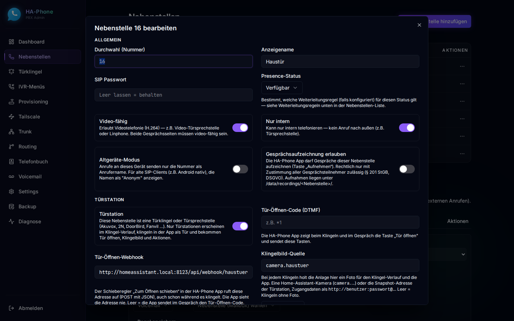
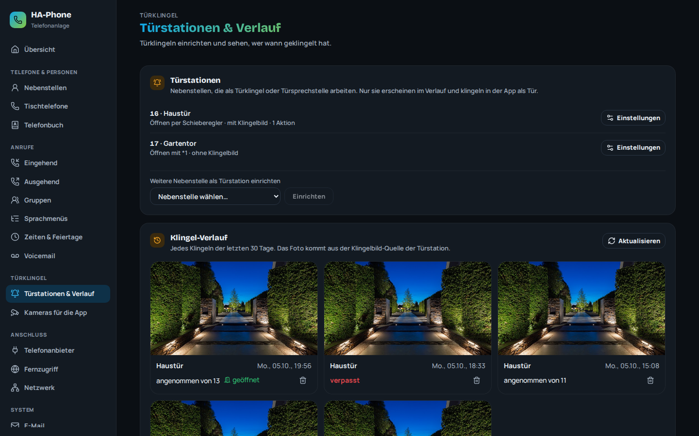
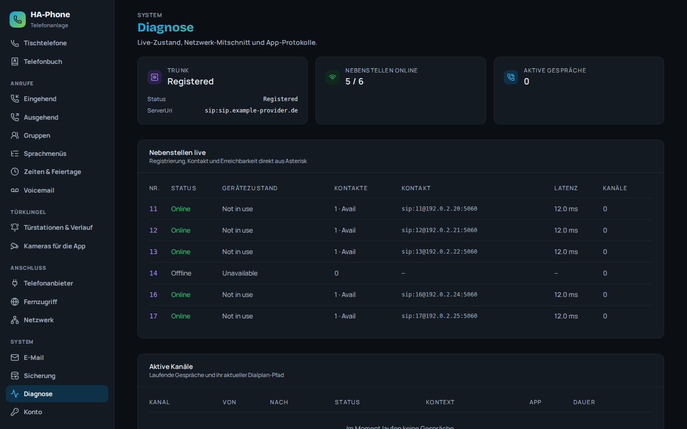

<div align="center">


# HA-Phone

**Full-featured SIP PBX for Home Assistant** — powered by Asterisk 22.x LTS, managed entirely through a modern web UI. No command line, no config files, no SSH.


</div>

---

HA-Phone turns your Home Assistant into a complete telephone system: connect a SIP trunk from your provider, register desk phones, DECT bases, door stations and the **HA-Phone App** on your mobile, and route calls — all from a clean dark-mode dashboard.



> All screenshots show example data.

## Features

- **📞 Any SIP trunk** — works with all standard providers (Telekom, Vodafone, 1&1, Sipgate, Deutsche Glasfaser / outbox, and many more). Registration, CLIP (outbound caller ID), and a selectable codec list.
- **☎️ Extensions** — internal SIP accounts with auto-generated passwords, presence status (available, away, do not disturb, off work) with per-status forwarding, optional **internal-only** mode and a **fallback to a mobile number** when no device of the extension is reachable.
- **🚪 Door stations** — mark any extension as a **door station** (Akuvox, 2N, DoorBird, Fanvil, …) and get a **doorbell history with a photo of every ring** (who answered, whether the door was opened), a **door-open webhook** (e.g. a Home Assistant automation), a DTMF door code and **Home Assistant action buttons** in the app. Door calls can skip the phones of people who are away while someone is at home.
- **📱 HA-Phone App** — the companion app for Android ([iron-exx/ha-phone-app](https://github.com/iron-exx/ha-phone-app)): pairs by QR code, rings like a normal phone call even when locked, shows the door camera **before you answer** and opens the door with a swipe.
- **🌍 Remote access without port forwarding** — with the Tailscale add-on on your Home Assistant host, the app reaches HA-Phone through your tailnet on mobile data. Pairing can even join the phone to the tailnet automatically.
- **🔀 Call routing** — editable **outbound dial rules** (pattern / strip / prepend), **inbound routes** (DID → extension, ring group or IVR, format-tolerant matching), **ring groups**, **IVR menus** with uploaded greetings, time conditions and holidays.
- **📟 Auto-provisioning** — configure IP phones, DECT bases and door stations by MAC address, like 3CX/Yeastar. Ships with **editable templates** for Yealink, Grandstream, Fanvil and Gigaset.
- **📬 Voicemail** — per-extension mailboxes with **voicemail-to-email** via your own SMTP server.
- **📒 Phonebook** — shared contacts, served to desk phones via LDAP and to the app.
- **📊 Live dashboard and diagnostics** — active calls, registrations with IP, latency and device type, trunk status, one-click network trace (PCAP) for Wireshark.
- **🔒 Secure by default** — SIP over TLS, the app API over HTTPS with certificate pinning (fingerprint in the pairing QR), per-device tokens stored as hashes, admin login throttling.
- **⬆️ Updates and backup** — update from the UI via the Home Assistant Supervisor, download and restore a backup of the whole configuration.

<p>
  
  
</p>
<p>
  
  
</p>

## Installation

1. In Home Assistant: **Settings → Add-ons → Add-on Store → ⋮ → Repositories**, add:
   ```
   https://github.com/iron-exx/HA-Phone
   ```
2. Install **HA-Phone** and start it.
3. Open the UI from the sidebar. Default password: `changeme` (you'll be asked to change it on first login).

## First steps

1. **Trunk** — enter your provider's SIP credentials (login name, password, phone number). See the notes below for Deutsche Glasfaser / outbox.
2. **Extensions** — add one extension per phone. The SIP password is auto-generated.
3. **Devices** — pair a mobile with the HA-Phone App (**Nebenstellen → ⋯ → HA-Phone App QR**), set up desk phones with **Auto-Provisioning**, or register any SIP device by hand (server = the Home Assistant host IP, user = extension number, password = the extension's SIP password).
4. **Routing** — outbound rules come pre-filled with sensible defaults; add an inbound route (your number → an extension or ring group).

## Door stations

1. Add an extension for the door station and register the door station against it (or use Auto-Provisioning).
2. Edit the extension (**Nebenstellen → ⋯ → Bearbeiten**) and switch on **Door station** (*Türstation*). Then fill in what you need (the UI is in German):
   - **Door-open webhook** (*Tür-Öffnen-Webhook*) — HA-Phone calls this URL (POST with JSON) when someone swipes "slide to open" in the app, even while it is still ringing. Typically a Home Assistant automation with a webhook trigger that switches your door opener. The app never sees the URL.
   - **Door-open code** (*Tür-Öffnen-Code (DTMF)*) — alternative for door stations that open with a key code during a call.
   - **Snapshot source** (*Klingelbild-Quelle*) — a Home Assistant camera (`camera.…`) or the door station's snapshot URL. HA-Phone takes a picture on every ring for the doorbell history and the app. Use *Testbild holen* to check it.
   - **Home Assistant actions** (*Home-Assistant-Aktionen*) — buttons like "Light entrance" that the app shows while the door is ringing or during the call.
3. Switch on **Video-capable** (*Video-fähig*) for the door station and the phones that should see the camera. Video uses H.264 via SIP early media, so the picture is there before anyone answers.
4. Create a ring group (e.g. `20 Doorbell`) with the phones that should ring and point the door station's call button to it.

**Extra cameras for the app:** under **Türklingel → Kameras für die App** you choose which Home Assistant cameras the paired phones may show (e.g. garden or driveway) and give them a name for the app. Nothing is shared by default, so private cameras such as a baby monitor never reach a phone. Each phone picks from that list in the app; the pictures show on the start page, on the ringing screen and during a door call. While a door rings, HA-Phone keeps fetching the shared cameras, so every ringing phone gets the newest picture at once. Pictures always go through HA-Phone, the phones never talk to Home Assistant directly.

Tip for phones that are away: set **Belongs to** (*Gehört zu (Home-Assistant-Person)*) at a mobile extension. While someone else is at home, the door does not ring that mobile. If nobody is at home, it rings everywhere.

## Remote access

**With the HA-Phone App (recommended):** install the **Tailscale** add-on on your Home Assistant host and join it to your tailnet (userspace networking off). HA-Phone detects it on the **Tailscale** page. From then on, pairing a phone also sets up its tailnet access, either by signing in once on the phone or fully automatic with an OAuth client. On mobile data the app connects through the tailnet, at home it takes the direct path. No ports are opened to the internet.

**With other SIP softphones** (Linphone, Zoiper, …): connect the phone to your tailnet or another VPN and use the Tailscale IP of the Home Assistant host as the SIP server. VPN peers count as local, so audio and video flow through the tunnel. Do not use the Home Assistant ingress URL, Cloudflare tunnels or reverse proxies for SIP.

## Network

HA-Phone uses the host network (RTP needs UDP port ranges the add-on network does not support).

| Port | Protocol | Purpose |
|------|----------|---------|
| 5060 | UDP/TCP | SIP |
| 5061 | TLS | SIP over TLS (HA-Phone App, TLS phones) |
| 5063 | TLS | SIP over TLS on the Tailscale interface |
| 80 | TCP | Web UI (also via Home Assistant ingress) and provisioning |
| 8443 | HTTPS | App API (certificate pinned by the app) |
| 3478 | UDP | STUN for the app |
| 389 | TCP | LDAP phonebook for desk phones |
| 10000–10200 | UDP | RTP audio and video |

AMI and ARI are bound to `127.0.0.1` and are not reachable from the LAN.

## Provider notes — Deutsche Glasfaser / outbox

DG resells the outbox / aarenet platform. Two things differ from a "typical" trunk and are handled automatically by HA-Phone:

- **Login name ≠ phone number.** Authentication uses the **SIP account** from the provider letter; the registration/AOR identity is the **phone number** (national format with leading 0, e.g. `0301234567`). Enter the SIP account under *Login name* and the number under *Phone number*.
- **SRV / DNS.** The registrar `dg.voip.dg-w.de` uses SRV records — HA-Phone resolves them correctly (no manual proxy needed).

More: [Fritz!Box as a trunk](docs/FRITZBOX.md), add-on documentation in [ha-phone/DOCS.md](ha-phone/DOCS.md), changes in [ha-phone/CHANGELOG.md](ha-phone/CHANGELOG.md).

## Support

Issues and questions: [github.com/iron-exx/HA-Phone/issues](https://github.com/iron-exx/HA-Phone/issues)

## License

Copyright (C) 2026 Sandro Ahrens. All Rights Reserved.

This repository is source-available for viewing only. No license to use, copy, modify, or distribute this software — commercially or otherwise — is granted. See the LICENSE file for details.
